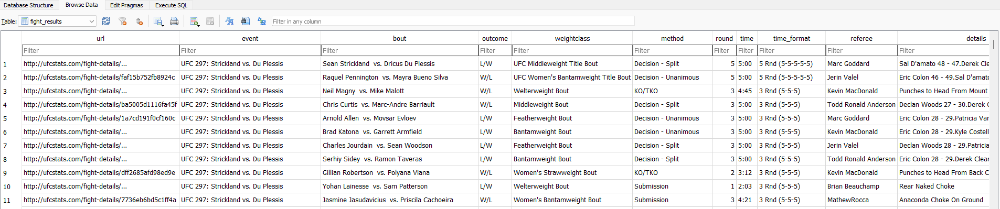

# Relational database based on the CSV data

## How to setup the database
#### Create the database with the base structure, primary & foreign keys
1. ```python create_database.py```

#### Populate the database with the CSV data
2. ```python create_database.py```

## (Optional) How to visualize the database data and run SQL queries easily

#### Download DB Browser for SQLite
1. Go to: https://sqlitebrowser.org/dl/
2. Pick the appropriate release for your system (ex: for 64-bit Windows)
3. Install it and open DB Browser

#### Open the database in DB Browser
1. File --> Open Database OR drag-and-drop the ```ufc_database.db``` into the software directly
2. You'll have 4 tabs: 
   1. ```Database Structure``` --> You'll see the tables
   2. ```Browse Data``` --> You select a table and look at the data
   3. ```Edit Pragmas``` --> ignore
   4. ```Excecute SQL``` --> Run SQL queries here

In ```Browse Data```, it should look something like this:
